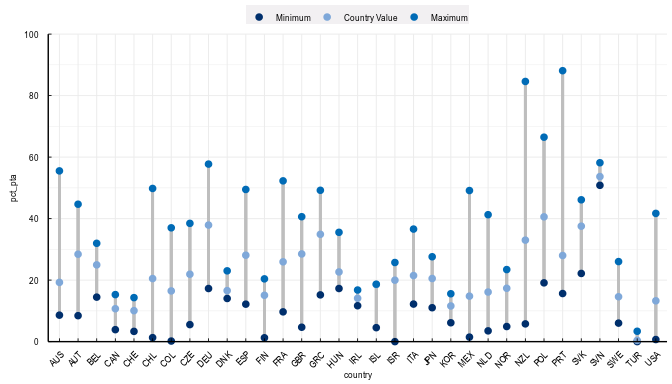

<!-- README.md is generated from README.Rmd. Please edit that file -->

# oecdplot

<!-- badges: start -->
<!-- badges: end -->

The goal of oecdplot is to create ggplot objects that are compatible
with PAC standards for publication.

Maps are out of the scope for this project.

## Installation

### No installation is required

Just run `library(oecdplot)` from RStudio and that’s it. Arnaud Atoch
already configured OECD servers to provide this software with end user’s
installation.

However, you can install the software from here in the event that you
want to test the experimental version.

### Without using a GitLab token

[Download
oecdplot](https://algobank.oecd.org:4430/r-oecd-graphs/oecdplot/-/archive/main/oecdplot-main.tar.gz),
then run

``` r
install.packages("C:/Users/You_R_Name/Downloads/oecdplot-main.tar.gz",
repos = NULL,
type ="source")
```

Please note that you have to replace `You_R_Name` with
`VargasSepulveda_M` or similar in the code above.

### Using a GitLab token

Copy and adapt these lines:

``` r
remotes::install_gitlab("r-oecd-graphs/oecdplot", host = "https://algobank.oecd.org:4430", upgrade = "never", auth_token = "MY_TOKEN")
```

If you don’t have a token, go to [Personal Access
Tokens](https://algobank.oecd.org:4430/-/profile/personal_access_tokens).
Create a new token that has `read_api`, `read_user`, `read_repository`
scopes. Set a expiry date (i.e., 90 days from now) and don’t forget to
store your token in a safe location (i.e. 1 Password).

Remember to replace `MY_TOKEN` with `ABC123CDE...` (i.e. your actual
token).

## Examples

Just in case here’s a MWE. There are detailed examples in the docs
folder. The output is in low DPI intentionally.

``` r
library(oecdplot)

load_oecd_fonts()

oecd_maxmin(data = pta, x = country, y = pct_pta, colour = category)
```



Then you can save your plot with `save_oecd_chart()`, which saves the
last plot by default, unless you specify `save_oecd_chart(g3)` or
similar. This option uses PAC rules for width, height and DPI.

## Reviewing

This package is ready for review, and already includes a basic
documentation. Please test, and write your feedback
[here](https://algobank.oecd.org:4430/r-oecd-graphs/oecdplot/-/issues/new?issue%5Bmilestone_id%5D=).

What I am trying to improve now is

-   Is the package easy to use?
-   Is the documentation clear?
